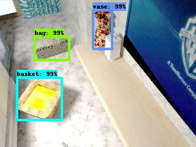
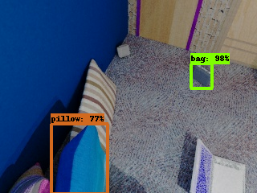

# SNVIP Dataset
Synthetic  Dataset  of  Objects  Commonly  Used  by Visually-Impaired People in their Everyday Life  
This is the dataset used for a research paper

    
[//]: # (Alejandro Gomez-Garay, Bogdan Raducanu, Joaquín Salas)  

The paper addresses the problem of construct and benchmark a dataset of every daily life objects used by visually-impaired people.  

<table>
    <tr>
        <td>  </td>
        <td>  </td>
    </tr>
</table>

We provide:  

    A dataset of synthetic images with bounding box (TF-Record format):  
        version 1 with dictionary of 50,743 images and 76,690 object instances

        See the data folder to download the files  
    
    Four trained models on the first version of the dataset (TF format)  
        SSD ResNet-50 FPN  
        Faster R-CNN Inception v2  
        Faster R-CNN ResNet-50  
        SSD Inception v2  
        See the model folder to download the files  

If you find this dataset useful in your research, please cite us:  

As a derivation from [SceneNet 2.0](https://robotvault.bitbucket.io/scenenet-rgbd.html), we provide this dataset with the [Creative Commons CC BY 4.0 License](http://creativecommons.org/licenses/by/4.0/)
